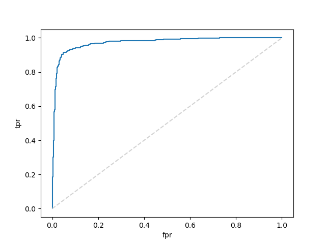
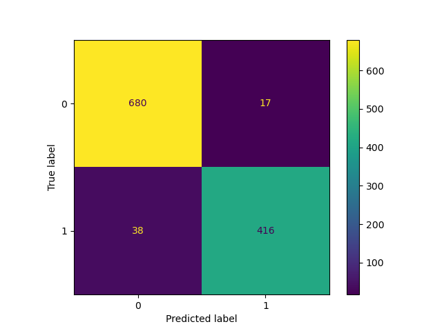

# Week_13_challenge

**In this challenge we were tasked with evaluating the performance of a Logistic Regression model and a Random Forest Classifier in trying to predict if an email was spam. After performing a brief exploration of the dataset we noticed that the target variable was slightly unbalanced 60% of the cases were not spam vs. 40% were, with this in mind we then proceeded to generate the models, train and test them on thier training set as well as their testing set.**

### Logistic Regression
**-Accuracy score for training data: 0.929** 
**-Accuracy score for testing data: 0.464**

**After examining the accuracy score for the testing set we can clearly see that the model did not perform well, by looking at the confusion matrix and the classification report we can see that the model did well when predicting that email was spam but had a lot of difficulty in detecting when it was not.**

                precision    recall  f1-score   support

           0        1.00      0.11      0.21       697
           1        0.42      1.00      0.60       454

    accuracy                            0.46      1151
    macro avg       0.71      0.56      0.40      1151
    weighted avg    0.77      0.46      0.36      1151

**Finally to guage the overall performance we plotted the ROC curve and calculated the AUC which for this model was of 0.716**

### Random Forest Classifier
**For this model we first determined the most beneficial number of estimators out of 300 possibilities and by looking at the graph we can see that the best n_estimators is 202**

**-n_estimators : 202** 
**-Accuracy score for training data: 1.00** 
**-Accuracy score for testing data: 0.851**

**After examining the accuracy score for the testing set we see that the model performed better than logistict regression, but to gain better insight to why this is the case we examined the confusion matrix and the classification report.**

                  precision  recall  f1-score   support

           0        0.81      0.98      0.89       697
           1        0.96      0.65      0.77       454

    accuracy                            0.85      1151
    macro avg       0.89      0.82      0.83      1151
    weighted avg    0.87      0.85      0.84      1151

**The report shows that in classifying if the email was spam this model under performed the logistic regression model by 4% but was approximately 40% better at determining when the email was not spam. The overall performance was much improved in this model which had an 
AUC of 0.952**

**After looking at all the metrics avaliable we determined that the Random Forest classifier was the better model for this application.**