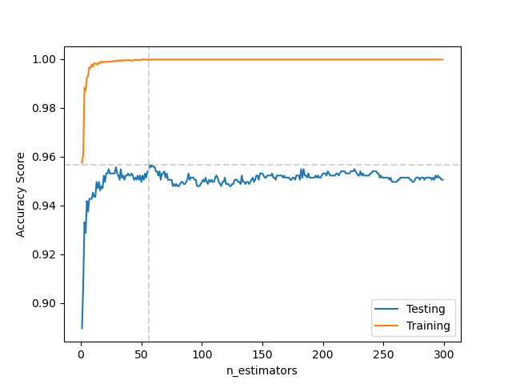
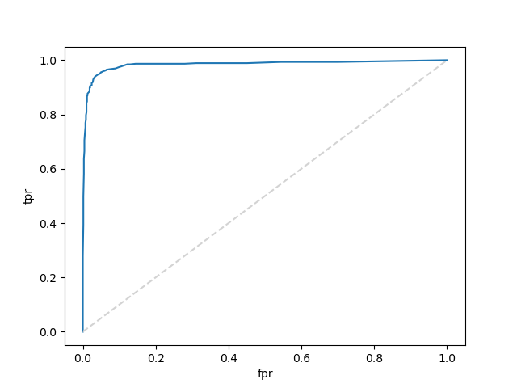

# Week_13_challenge

**In this challenge we were tasked with evaluating the performance of a Logistic Regression model and a Random Forest Classifier in trying to predict if an email was spam. After performing a brief exploration of the dataset we noticed that the target variable was slightly unbalanced 60% of the cases were not spam vs. 40% were, with this in mind we then proceeded to generate the models, train and test them on thier training set as well as their testing set.**

### Logistic Regression
**-Accuracy score for training data: 0.929** 
**-Accuracy score for testing data: 0.934**

**After examining the accuracy score for the testing set we can clearly see that the model performed well, by looking at the confusion matrix and the classification report we can see that the model did very well when predicting that email was spam but did even better detecting when it was not.**

            0       0.93      0.96      0.94       697
            1       0.93      0.88      0.91       454

    accuracy                            0.93      1151
    macro avg       0.93      0.92      0.92      1151
    weighted avg    0.93      0.93      0.93      1151

**Finally to guage the overall performance we plotted the ROC curve and calculated the AUC which for this model was of 0.973**

### Random Forest Classifier
**For this model we first determined the most beneficial number of estimators out of 300 possibilities and by looking at the graph we can see that the best n_estimators is 56 approximately**

**-n_estimators : 56** 
**-Accuracy score for training data: 1.00** 
**-Accuracy score for testing data: 0.986**

**After examining the accuracy score for the testing set we see that the model performed slightly better than logistict regression, but to gain better insight to why this is the case we examined the confusion matrix and the classification report.**

                  precision    recall  f1-score   support

           0       0.95      0.97      0.96       697
           1       0.96      0.92      0.94       454

    accuracy                            0.95      1151
    macro avg       0.95      0.95      0.95      1151
    weighted avg    0.95      0.95      0.95      1151

**The report shows that in classifying if the email was spam this model out performed the logistic regression model by 3% and was approximately 2% better at determining when the email was not spam. The overall performance slightly better in this model which had an AUC of 0.986**

**After looking at all the metrics avaliable we determined that the Random Forest classifier was the better model for this application but for the computing power availble to us it took significantly more time to tune the hyperparameters, this is why we are choosing the logistic regression model, it produces comparable performande with way less use of computing power.**